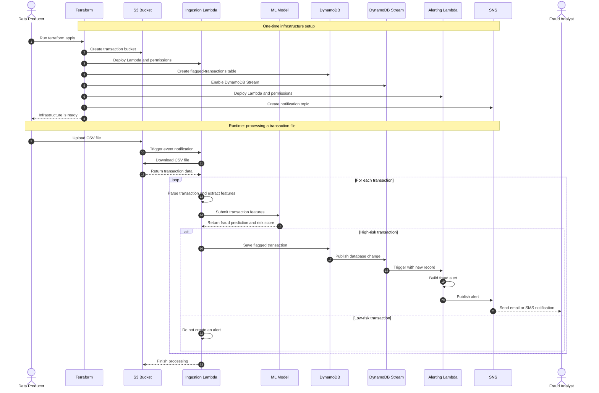

# Serverless Fraud Detection Pipeline

## Architecture

```mermaid
sequenceDiagram
    autonumber

    actor User as Data Producer
    participant Terraform
    participant S3 as S3 Bucket
    participant Ingestion as Ingestion Lambda
    participant Model as ML Model
    participant DynamoDB
    participant Stream as DynamoDB Stream
    participant Alerting as Alerting Lambda
    participant SNS
    actor Recipient as Fraud Analyst

    Note over Terraform,SNS: One-time infrastructure setup
    User->>Terraform: Run terraform apply
    Terraform->>S3: Create transaction bucket
    Terraform->>Ingestion: Deploy Lambda and permissions
    Terraform->>DynamoDB: Create flagged-transactions table
    Terraform->>Stream: Enable DynamoDB Stream
    Terraform->>Alerting: Deploy Lambda and permissions
    Terraform->>SNS: Create notification topic
    Terraform-->>User: Infrastructure is ready

    Note over User,SNS: Runtime: processing a transaction file
    User->>S3: Upload CSV file
    S3->>Ingestion: Trigger event notification
    Ingestion->>S3: Download CSV file
    S3-->>Ingestion: Return transaction data

    loop For each transaction
        Ingestion->>Ingestion: Parse transaction and extract features
        Ingestion->>Model: Submit transaction features
        Model-->>Ingestion: Return fraud prediction and risk score

        alt High-risk transaction
            Ingestion->>DynamoDB: Save flagged transaction
            DynamoDB->>Stream: Publish database change
            Stream->>Alerting: Trigger with new record
            Alerting->>Alerting: Build fraud alert
            Alerting->>SNS: Publish alert
            SNS-->>Recipient: Send email or SMS notification
        else Low-risk transaction
            Ingestion->>Ingestion: Do not create an alert
        end
    end

    Ingestion-->>S3: Finish processing
```